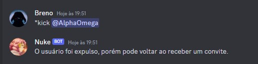
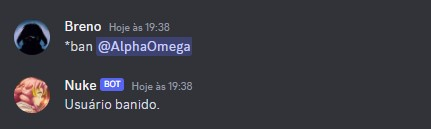
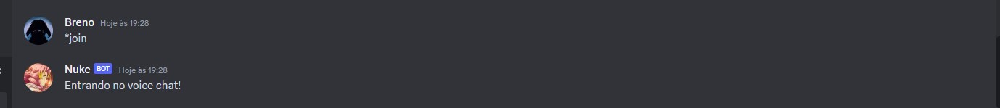

# Nuke bot

Nuke é um bot para servidores do discord, ainda em fase de desenvolvimento, até o momento possuí funcionalidades de moderação e também recreativas.

## Adicionar ao seu servidor
Para ter todos os comandos disponiveis no seu servidor, basta clicar no seguinte link:
https://discord.com/api/oauth2/authorize?client_id=1097264327800664185&permissions=8&scope=bot

# Features

### Moderação

- Expulsar membro de forma temporária, o usuário pode voltar ao servidor ao ser convidado novamente

- Banir membro de forma permanente:

### Recreativas

- Entra no voice chat junto com o membro que executou o comando

- Toca a música/podcast do link passado pelo membro

## Segurança e permissões

Para executar todas suas funções de maneira plena, o bot necessita de permissão de administrador no servidor, as funções recreativas como chamar o bot para o canal de voz e escutar uma música pode ser executada por qualquer membro do servidor, enquanto as funções de moderação só podem ser executadas por membros com as devidas autorizações.

